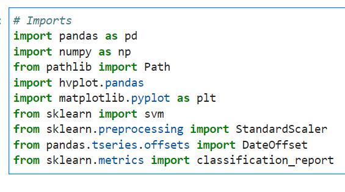
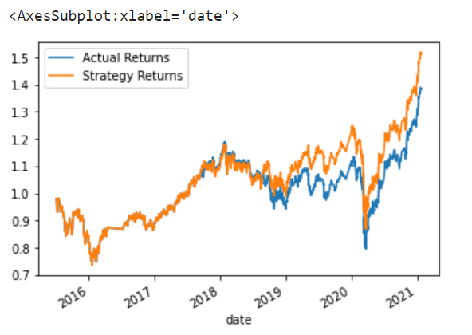
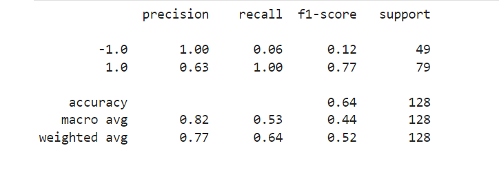
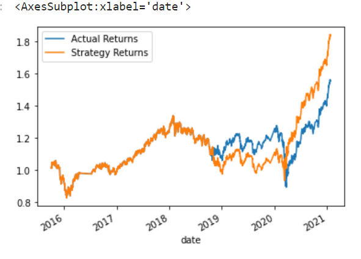
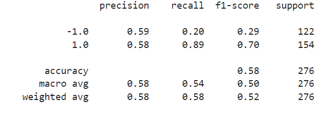
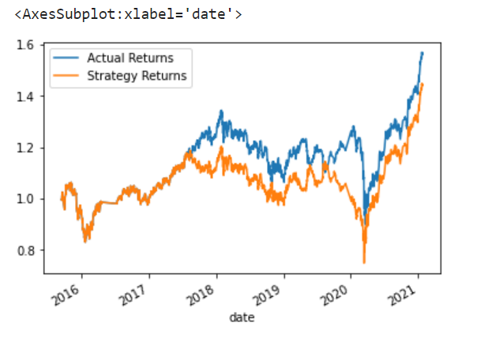
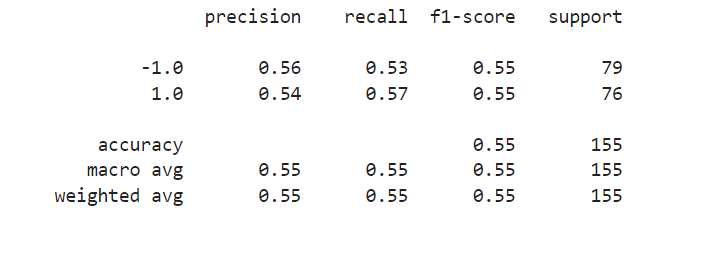
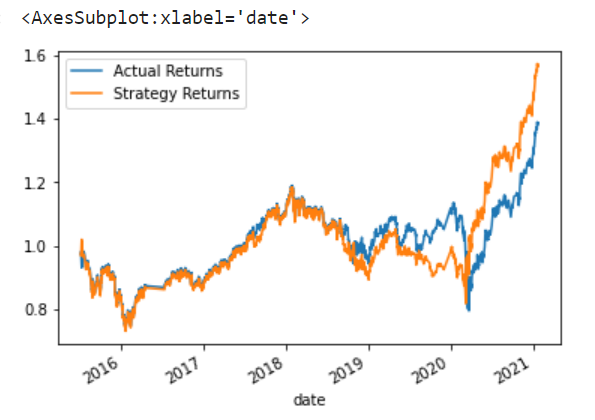
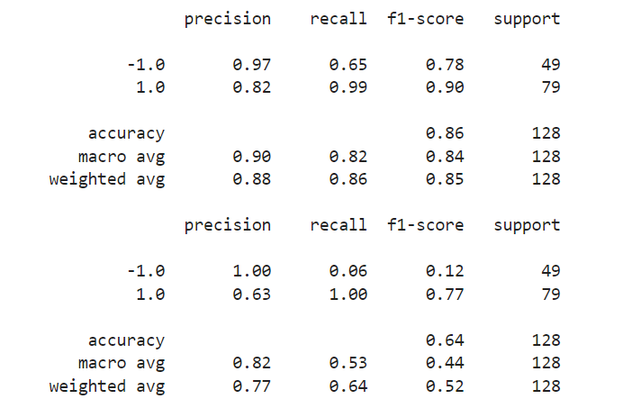

# Emerging-Markets
I am a financial advisor at one of the top five financial advisory firms in the world. My firm constantly competes with the other major firms to manage and automatically trade assets in a highly dynamic environment. In recent years, my firm has heavily profited by using computer algorithms that can buy and sell faster than human traders.

The speed of these transactions gave us a competitive advantage early on. But, people still need to specifically program these systems, which limits their ability to adapt to new data. I am planning to improve the existing algorithmic trading systems and maintain the firm’s competitive advantage in the market. I will be enhancing the existing trading signals with machine learning algorithms that can adapt to new data.
## Technologies
Resources included 1 csv file:

(Resources/emerging_markets_ohlcv.csv)

### Tools:

Libraries and dependencies:

#### Imports

import pandas as pd

import numpy as np

from pathlib import Path

import hvplot.pandas

import matplotlib.pyplot as plt

from sklearn import svm

from sklearn.preprocessing import StandardScaler

from pandas.tseries.offsets import DateOffset

from sklearn.metrics import classification_report

## Installation Guide
Installation requirements for this project included Python and Panda Libraries available in Jupyter Lab.

## Results

### Original training and testing (3 Months training Dateoffset short window=4, long window=100)

The original training and testing indicated a 100% for -1 and 63% for 1. I then modified the training dateoffset and then the SMA windows to see if it would result in greater precision. 

### 6 Month Training Dateoffset (Windows remain the same short=4, long=100)

What impact resulted from increasing or decreasing the training window?

The training widow Dateoffset was increased from 3 to 6 months and the results show that the precision decreased from 100% for -1 to 59% and from 63% for 1 to 58%. These agjustments did not improve the precision and in fact worsened. 

SMA short window=50 long window=200 (3 months training Dateoffset)

What impact resulted from increasing or decreasing either or both of the SMA windows?

I chose to increase the windows and the results indicate that the precision for -1 decreased to 56% when originally it was 100% for -1 and 63% to 54%

AdaBoostClassifier (ABC)

Did this new model perform better or worse than the provided baseline model? Did this new model perform better or worse than your tuned trading algorithm?

Although the AdaBoost showed a decrease in precision for -1 from 100% to 97%, precision for 1 increase from 63% to 82%. Overall the new model performed better than the baseline model. 

## Contributors

#### Contact
zehra.vahidy@gmail.com
LinkedIn https://www.linkedin.com/in/zehra-vahidy-6025b820

---

## License

Unlicesened

## Appendix
https://docs.github.com/en/get-started/writing-on-github/getting-started-with-writing-and-formatting-on-github/basic-writing-and-formatting-syntax#headings
https://jupyterlab.readthedocs.io/en/stable/

